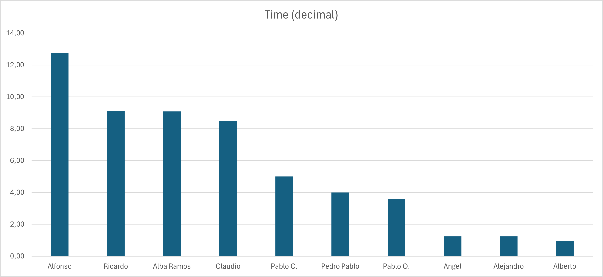
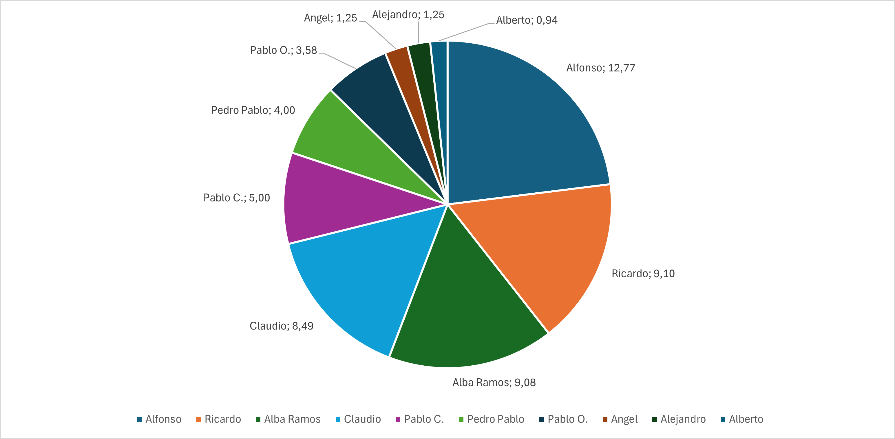

  
  

<h1 align="center">Reporte de horas</h1>

    Grupo 7

    ISPP-MapYourWorld

    WPL

    Alfonso Luis Alonso Lanzarán

    22/05/2025

**CONTROL DE VERSIONES**

| VERSIÓN | FECHA     | COMENTARIOS              | AUTOR              |
|---------|-----------|--------------------------|--------------------|
| V1      | 22/05/2025| Primera versión          | Alfonso Luis Alonso Lanzarán |

<!-- omit in toc-->
# Índice
- [Índice](#índice)
  - [1. Resumen ejecutivo](#1-resumen-ejecutivo)
  - [2. Gráficas del tiempo invertido](#2-gráficas-del-tiempo-invertido)
    - [2.1. Gráfico de barras](#21-gráfico-de-barras)
    - [2.2. Gráfico de sectores](#22-gráfico-de-sectores)
  - [3. Datos originales exportados de clockify](#3-datos-originales-exportados-de-clockify)

## 1. Resumen ejecutivo

En este documento se muestra la cantidad de horas invertidas en el proyecto por cada miembro del equipo, en el siguiente punto se comentan los desvíos de las horas planificadas para este sprint (20 horas)

NOTA: El "pantallazo" de las horas ha sido tomado el día 22/05 a aproximadamente las 21:00

## 2. Gráficas del tiempo invertido

### 2.1. Gráfico de barras

### 2.2. Gráfico de sectores

## 3. Datos originales exportados de clockify

Se pueden encontrar en (Documentación sobre el equipo/Datos originales clockify.pdf)
